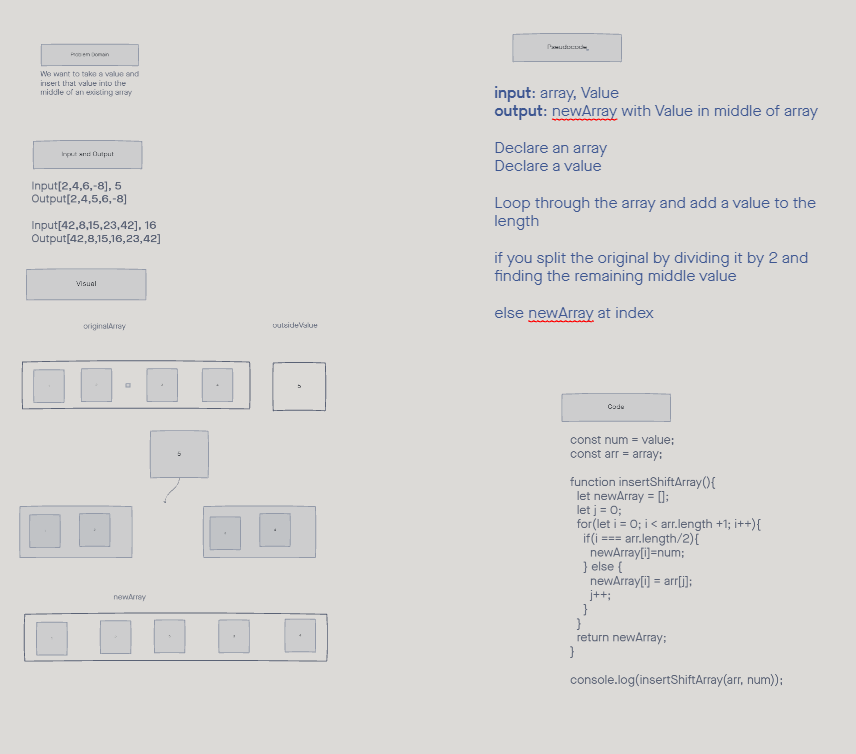

# Array Insert Shift  

## Inputs / Outputs  
- Input[2,4,6,-8], 5  
Output[2,4,5,6,-8]  

- Input[42,8,15,23,42], 16  
Output[42,8,15,16,23,42]
  

## Problem Domain  
- We want to take a value and insert that value into the middle of an existing array

## Pseudocode  
- input: array, Value

- output: newArray with Value in middle of array

- Declare an array 
- Declare a value

- Loop through the array and add a value to the length

- if you split the original by dividing it by 2 and finding the remaining middle value

- else newArray at index 

## Whiteboard  
