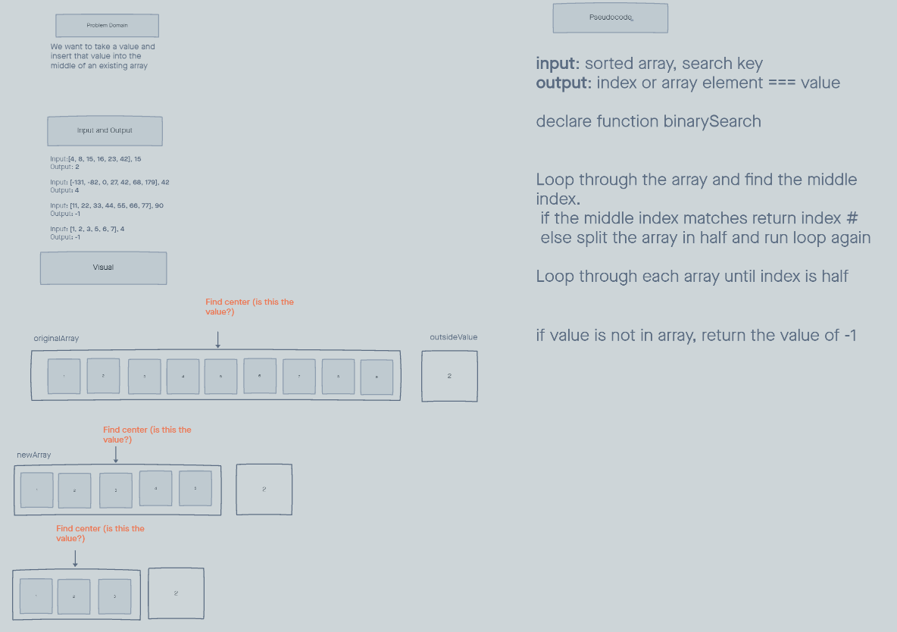

# array-binary-search  

## Inputs / Outputs  
- Input:[4, 8, 15, 16, 23, 42], 15  
Output: 2

- Input: [-131, -82, 0, 27, 42, 68, 179], 42  
Output: 4

- Input: [11, 22, 33, 44, 55, 66, 77], 90  
Output: -1

- Input: [1, 2, 3, 5, 6, 7], 4  
Output: -1

## Problem Domain  
- We want to take a value and insert that value into the middle of an existing array  

## Pseudocode  
- input: sorted array, search key

- output: index or array element === value  

- declare function binarySearch  

- Loop through the array and find the middle index.  

- if the middle index matches return index #  

- else split the array in half and run loop again  

- Loop through each array until index is half  

- if value is not in array, return the value of -1  

## Whiteboard  
