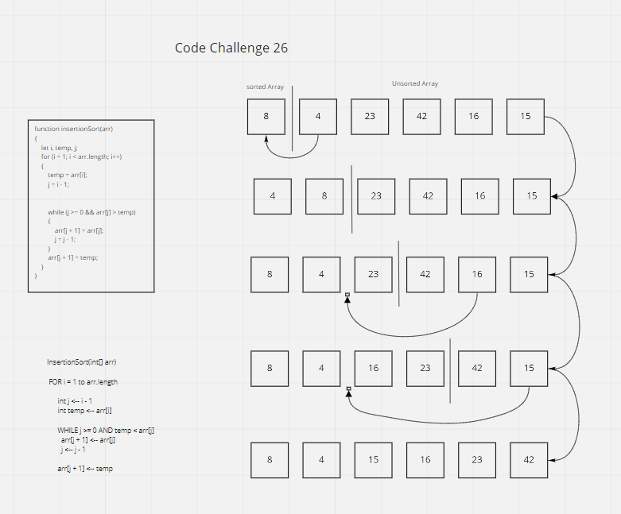
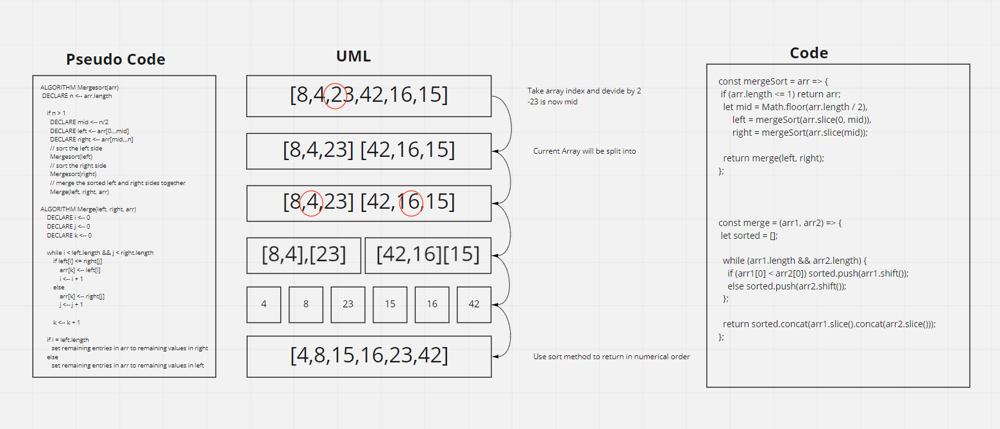

# Code Challenge 26  

## Stepping through Pseudocode  
   - We start with a method called ```isertionSort()```  
   - With this method we are essentially making 2 arrays by splitting the given array at the index  
   - The loop will check to see if the trailing number is less then the current number, if so, the values will swap, if not, it will remain in its place.
   - the loop will continue to do this until all of the values are in order from lowest to highest

  


Ref: [Insertion Sort](https://www.geeksforgeeks.org/insertion-sort/)  
Ref: [Selection Sort](https://codefellows.github.io/common_curriculum/data_structures_and_algorithms/Code_401/class-26/solutions/BLOG)  

Colaboration w/ Tray Chea, and Joe Ivans  

# Code Challenge 27    

