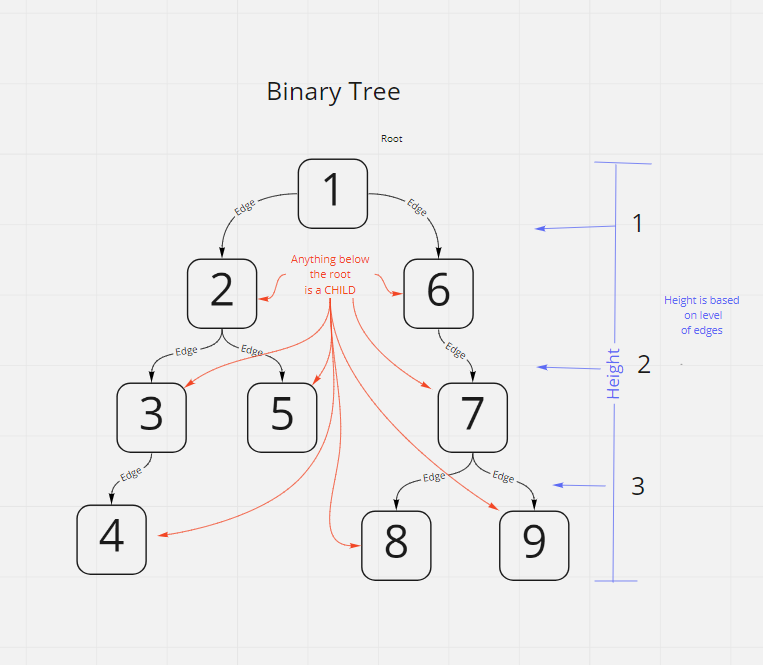
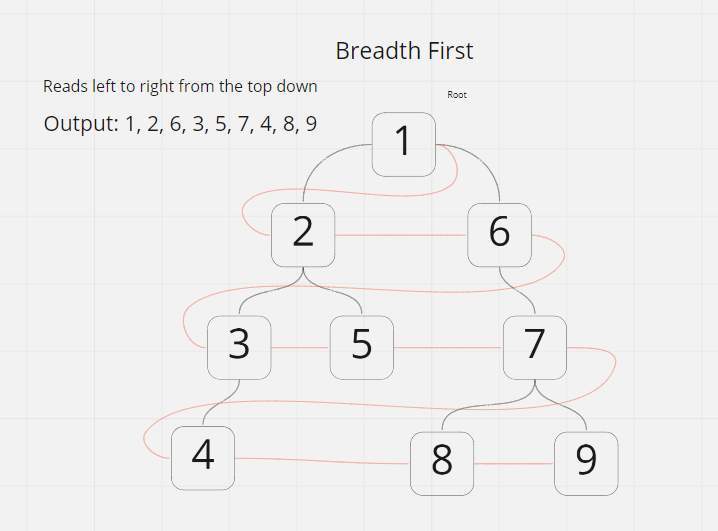

# Trees
<!-- Short summary or background information -->

## Challenge
### Binary Search Tree  
   - Create a Binary Search Tree class  
     - This class should be a sub-class (or your languages equivalent) of the Binary Tree Class, with the following additional methods:  
     - Add
       - Arguments: value  
       - Return: nothing  
       - Adds a new node with that value in the correct location in the binary search tree.
      
    - Contains
      - Argument: value
      - Returns: boolean indicating whether or not the value is in the tree at least once.  

### Breadth First  
  - Write a function called breadth first  
  - Arguments: tree  
  - Return: list of all values in the tree, in the order they were encountered

## Approach & Efficiency
<!-- What approach did you take? Why? What is the Big O space/time for this approach? -->

## UML  
  
