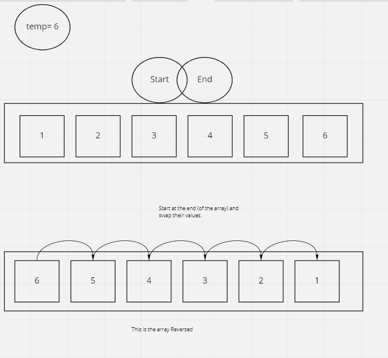

# Reverse Array

Inclueds a function that takes in some array, and returns an array with all the elements in revese order.

## Inputs /Outputs

input: [1, 2, 3, 4, 5, 6]  
output: [6, 5, 4, 3, 2, 1]

## Algorithm

If we can grab the ens of the array, we can just swap their values  

* use a for loop to look at all of the elements in the array.(iterating through the array)  
* At each Item, I swap with the inverse array index.
* Only go half way (give or take 1) and Stop 
* If we dont stop halfway we will re-swap


## Pseudocode  
### Formalize the operations

```
Reverse Array takes in `arr`:

    declare start <- 0  
    declare end <- lenth of arr minus 1  

    iterate over arr:
    While start =< End        d
        declare temp <- arr[start]
        arr[start] <- arr[end]
        arr[end] <- temp
        start = start +1
        end = end -1


        swap arr[n] <- arr  [length of array minus 1]>


```

## Actual Code  


## Visual 
